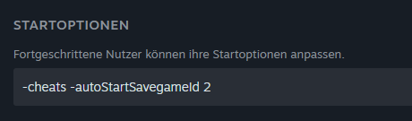

Willkommen! Dies ist meine (TuneWar) Dokumentationsseite für LS-Modding und Lua-Skripting.

Auf dieser Dokumentationsseite kann man sich oben mit den verschiedenen Themen befassen und über die Links auf die einzelnen Seiten gehen.

## Vorbereitung

Um automatisch in ein Savegame zu laden, kann man in den Startoptionen ein Autostart hinzufügen:

```
-autoStartSavegameId <save game nummer>
```


